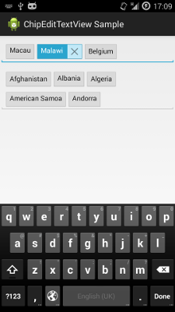
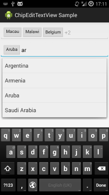

Introduction
============

ChipEditTextView is a modified RecipientEditTextView, which is an auto complete text view for use with applications that use the new Chips UI for showing tags. Instead of supporting phone numbers and email addresses, only normal tags are supported. 

&nbsp;
&nbsp;

Features
========
Many features of the RecipientEditTextView were removed. Following features are still supported:
 * Selectable/editable chips
 * View-Shrinking on focus changes
 * Fullscreen-Keyboard

Removed features are:
 * Recipients, phone & email address support
 * Async loading of recipients.
 * Dragging of chips
 * ContextMenu, paste, cut, copy
 * Invalid chips
 * ListPopup appearing  by click on chip
 * Icon/Drawable in chips
 
Usage
=====
 1. Fork & import chips-library as project.
 2. Add library reference to your target project.
 3. Define `chipEditTextViewStyle` in your app theme:

        

 4. Create a ListAdapter for suggestions and define a `ChipCreator`.

        // create adapter with chips.
        String[] countries = this.getResources().getStringArray(R.array.countries_array);
        ArrayAdapter<String> adapter = new ArrayAdapter<String>(this, 
      				R.layout.chips_dropdown_item_1, countries);
        adapter.setDropDownViewResource(android.R.layout.simple_dropdown_item_1line);
        
        chipEditTextView = (ChipEditTextView) findViewById(R.id.chipView);
        chipEditTextView.setAdapter(adapter);
        chipEditTextView.setCreator(new SimpleChipCreator(true));
        chipEditTextView.setOnFocusShrinkChips(false);
    
    
 5. You can use the `ChipCreator` and BaseChip interface to implement your custom chips:

        private static class DefinedChipCreator implements ChipCreator {
      		String[] mChips;
      		
      		public DefinedChipCreator(String[] chips) {
      			mChips = chips;
      		}
      		
      		@Override
      		public BaseChip createChip(CharSequence text) {
      			for(String chip : mChips) {
      				if(chip.equalsIgnoreCase(text.toString())){
      					return new SimpleChip(text, false);
      				}
      			}
      			return new SimpleChip(text, true);
      		}
      	}

 6. You want to append chips? But take care to avoid `setText`.

        String[] chips = new String() {"Germany", "France", "England"};
        for (String chip : chips) {
          chipEditTextView.append(chip);
        }
    
Check out project `chips-example` for more samples.

Origin:
=======
https://android.googlesource.com/platform/frameworks/ex/+/refs/heads/master/chips
  
    
